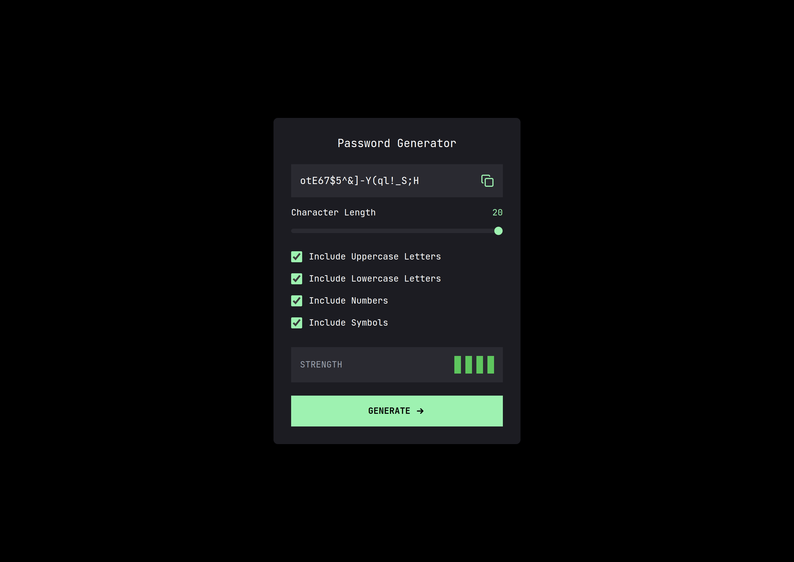

# Password Generator

This is a solution to the Password Generator project. This project helps you generate a secure and random password based on selected criteria.

## Table of contents

- [Overview](#overview)
  - [The challenge](#the-challenge)
  - [Screenshot](#screenshot)
  - [Links](#links)
- [My process](#my-process)
  - [Built with](#built-with)
- [Author](#author)
- [Acknowledgments](#acknowledgments)

## Overview

### The challenge

Users should be able to:

- Select criteria for the password (length, inclusion of special characters, numbers, etc.)
- Generate a random password based on the selected criteria
- Copy the generated password to the clipboard
- View the optimal layout for the interface depending on their device's screen size
- See hover and focus states for all interactive elements on the page

### Screenshot

### Links

- Live Site URL: [https://dev-nain.github.io/password-generator/](https://dev-nain.github.io/password-generator/)

## My process

### Built with

- Semantic HTML5 markup
- Tailwind
- Javascript

## Author

- GitHub - [dev-nain](https://github.com/dev-nain)
- Twitter - [nain_2206](https://x.com/nain_2206)
